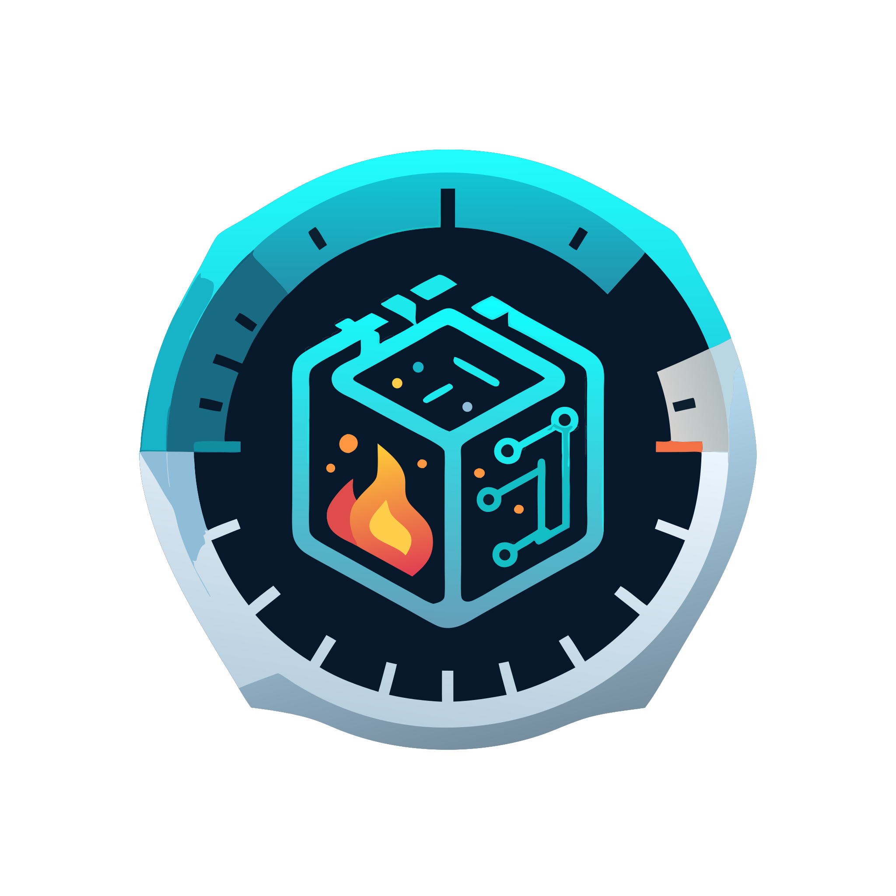

<div align="center">
  
  
  <h1>🔥 BurnDevice</h1>
  <p><strong>设备破坏性测试工具</strong></p>
  
  <p>
    <a href="https://golang.org">
      
    </a>
    <a href="coverage.out">
      
    </a>
    <a href="LICENSE">
      
    </a>
    <a href="docs/SECURITY.md">
      
    </a>
  </p>
  
  <p><em>专为<strong>授权测试环境</strong>设计的破坏性测试工具，用于评估系统的健壮性和恢复能力</em></p>
</div>

---

## ⚠️ 重要安全警告

**此工具具有极强的破坏性，仅限用于以下场景：**

- ✅ 授权的测试环境
- ✅ 个人拥有的测试设备
- ✅ 安全研究和教育目的
- ✅ 系统韧性测试

**严禁在以下场景使用：**

- ❌ 生产环境
- ❌ 他人设备
- ❌ 未经授权的系统
- ❌ 恶意攻击

**使用本工具即表示您同意承担所有风险和责任**

## 🚀 特性

- **多种破坏模式**: 文件删除、服务中断、内存耗尽、磁盘填满等
- **AI 驱动**: 集成 DeepSeek AI 生成智能攻击场景
- **安全控制**: 多层安全验证和目标限制机制
- **实时监控**: gRPC 流式接口实时监控破坏进度
- **可恢复性**: 支持不同严重级别的可恢复操作
- **审计日志**: 完整的操作记录和安全审计

## 🛠️ 技术栈

- **语言**: Go 1.24+
- **框架**: gRPC + Protocol Buffers
- **环境**: Nix Flakes
- **AI**: DeepSeek API 集成
- **配置**: Viper + YAML
- **日志**: Logrus 结构化日志

## 📦 安装和使用

### 🚀 快速开始

#### 二进制安装 (推荐)

从 [GitHub Releases](https://github.com/BurnDevice/BurnDevice/releases) 下载最新版本：

```bash
# Linux (x86_64)
curl -L https://github.com/BurnDevice/BurnDevice/releases/latest/download/burndevice-linux-amd64.tar.gz | tar -xz
sudo mv burndevice /usr/local/bin/

# macOS (Intel)
curl -L https://github.com/BurnDevice/BurnDevice/releases/latest/download/burndevice-darwin-amd64.tar.gz | tar -xz
sudo mv burndevice /usr/local/bin/

# macOS (Apple Silicon)
curl -L https://github.com/BurnDevice/BurnDevice/releases/latest/download/burndevice-darwin-arm64.tar.gz | tar -xz
sudo mv burndevice /usr/local/bin/

# Windows (PowerShell)
Invoke-WebRequest -Uri "https://github.com/BurnDevice/BurnDevice/releases/latest/download/burndevice-windows-amd64.zip" -OutFile "burndevice.zip"
Expand-Archive -Path "burndevice.zip" -DestinationPath "."
```

#### Docker 安装

```bash
# 从 GitHub Container Registry
docker pull ghcr.io/burndevice/burndevice:latest

# 运行服务器
docker run -p 8080:8080 ghcr.io/burndevice/burndevice:latest

# 运行客户端
docker run --rm ghcr.io/burndevice/burndevice:latest client --help
```

#### 从源码构建

```bash
# 克隆仓库
git clone https://github.com/BurnDevice/BurnDevice.git
cd BurnDevice

# 使用 Nix (推荐)
nix develop
make build

# 或使用 Go
go mod download
buf generate
go build -o bin/burndevice ./cmd/burndevice
```

### 🔧 验证安装

```bash
burndevice --version
```

## 🎯 使用指南

### 启动服务器

```bash
# 使用默认配置
burndevice server

# 使用自定义配置
burndevice server --config /path/to/config.yaml

# Docker 方式
docker run -p 8080:8080 -v /path/to/config.yaml:/app/config/config.yaml ghcr.io/burndevice/burndevice:latest
```

### 客户端操作

```bash
# 获取系统信息
burndevice client system-info

# 执行破坏性测试 (需要确认)
burndevice client execute \
  --type FILE_DELETION \
  --targets "/tmp/test.txt" \
  --severity LOW \
  --confirm

# 生成AI攻击场景
burndevice client generate-scenario \
  --target "Ubuntu 22.04 test server" \
  --max-severity MEDIUM

# 流式监控测试过程
burndevice client stream \
  --type MEMORY_EXHAUSTION \
  --targets "test-process" \
  --severity LOW \
  --confirm
```

## 📋 发布管理

### 🏷️ 版本发布流程

项目使用标准化的发布流程，支持语义化版本控制：

```bash
# 1. 检查发布准备
make release-check

# 2. 查看版本建议
make version-current  # 显示当前版本
make version-patch    # 建议补丁版本 (v1.0.1)
make version-minor    # 建议次版本 (v1.1.0)  
make version-major    # 建议主版本 (v2.0.0)

# 3. 执行发布
make release-tag VERSION=v1.0.0

# 4. 本地测试构建 (可选)
make release-local
```

### 📦 发布产物

每次发布会自动生成：

- **多平台二进制文件**: Linux (amd64/arm64), macOS (amd64/arm64), Windows (amd64)
- **Docker镜像**: `ghcr.io/burndevice/burndevice:VERSION`
- **源码归档**: 自动生成的tar.gz和zip文件
- **校验和文件**: SHA256校验和
- **发布说明**: 基于Git提交自动生成

### 🔄 版本策略

- **v1.0.0** - 稳定版本，向后兼容
- **v1.1.0** - 新功能版本，向后兼容
- **v1.0.1** - 补丁版本，bug修复
- **v1.0.0-alpha.1** - 预发布版本，用于测试

## 🛠️ 开发环境

### Nix Flake 开发环境 (推荐)

```bash
# 进入开发环境
nix develop

# 查看可用工具
make help
```

### 传统开发环境

确保安装以下工具：
- Go 1.24+
- Protocol Buffers 编译器
- Buf CLI
- Make

### 开发工作流

```bash
# 代码质量检查
make quality-check

# 运行测试
make test
make test-race
make test-coverage

# 安全检查
make security-check

# 构建所有平台
make build-all

# 开发模式运行
make run-dev
```

## 🎯 使用示例

### 生成 AI 攻击场景

```bash
./bin/burndevice client generate-scenario \
  --target "Linux测试服务器 - Ubuntu 22.04, 4GB RAM, 100GB磁盘" \
  --max-severity MEDIUM \
  --server localhost:8080
```

### 执行文件删除测试

```bash
# 安全删除（可恢复）
./bin/burndevice client execute \
  --type FILE_DELETION \
  --targets "/tmp/test_file.txt" \
  --severity LOW \
  --confirm

# 查看系统信息
./bin/burndevice client system-info
```

### 内存耗尽测试

```bash
# 低强度内存压测
./bin/burndevice client execute \
  --type MEMORY_EXHAUSTION \
  --severity LOW \
  --confirm
```

## 🔧 配置选项

### 安全配置

```yaml
security:
  require_confirmation: true      # 需要明确确认
  max_severity: "MEDIUM"         # 最大严重级别
  enable_safe_mode: true         # 启用安全模式
  audit_log: true               # 启用审计日志
  
  # 白名单：允许的目标路径
  allowed_targets:
    - "/tmp/burndevice_test"
    - "/home/user/test"
  
  # 黑名单：禁止的目标路径
  blocked_targets:
    - "/"
    - "/bin"
    - "/usr"
    - "/etc"
```

### AI 配置

```yaml
ai:
  provider: "deepseek"
  api_key: "${BURNDEVICE_AI_API_KEY}"
  base_url: "https://api.deepseek.com"
  model: "deepseek-chat"
  max_tokens: 4096
  temperature: 0.7
```

## 🛡️ 安全机制

1. **多重确认**: 要求明确的破坏确认
2. **路径限制**: 白名单/黑名单机制
3. **严重级别**: 限制最大破坏级别
4. **安全模式**: 仿真而非真实执行
5. **审计日志**: 记录所有操作
6. **权限检查**: 验证操作权限

## 📋 破坏类型

| 类型 | 描述 | 严重级别 | 可恢复性 |
|------|------|----------|----------|
| FILE_DELETION | 文件删除攻击 | LOW-CRITICAL | 视级别而定 |
| SERVICE_TERMINATION | 服务终止攻击 | LOW-HIGH | 高 |
| MEMORY_EXHAUSTION | 内存耗尽攻击 | LOW-HIGH | 高 |
| DISK_FILL | 磁盘填满攻击 | LOW-HIGH | 中 |
| NETWORK_DISRUPTION | 网络中断攻击 | MEDIUM-HIGH | 高 |
| BOOT_CORRUPTION | 引导损坏攻击 | HIGH-CRITICAL | 低 |
| KERNEL_PANIC | 内核崩溃攻击 | CRITICAL | 低 |

## 🧪 开发和测试

```bash
# 运行测试
make test

# 运行竞态检测
make test-race

# 生成覆盖率报告
make test-coverage

# 代码质量检查
make lint
make vet

# 安全检查
make security-check
```

## 🐳 Docker 支持

```bash
# 构建 Docker 镜像
make docker-build

# 运行容器
make docker-run
```

## 📚 API 文档

### gRPC 服务

```protobuf
service BurnDeviceService {
  rpc ExecuteDestruction(DestructionRequest) returns (DestructionResponse);
  rpc GetSystemInfo(SystemInfoRequest) returns (SystemInfoResponse);
  rpc GenerateAttackScenario(AttackScenarioRequest) returns (AttackScenarioResponse);
  rpc StreamDestruction(DestructionRequest) returns (stream DestructionEvent);
}
```

详细的 API 文档请参考 [burndevice/v1/service.proto](burndevice/v1/service.proto)

## 🤝 贡献

1. Fork 项目
2. 创建功能分支 (`git checkout -b feature/amazing-feature`)
3. 提交更改 (`git commit -m 'Add amazing feature'`)
4. 推送到分支 (`git push origin feature/amazing-feature`)
5. 开启 Pull Request

**注意**: 所有贡献必须通过安全审查，不得包含真正的恶意代码。

## 📄 许可证

本项目采用 MIT 许可证 - 详见 [LICENSE](LICENSE) 文件

## ⚖️ 法律声明

本工具仅用于合法的安全研究和测试目的。使用者有责任确保其使用符合当地法律法规。作者不对任何误用或损害承担责任。

## 🆘 支持

- 📖 [文档](docs/)
- 🐛 [问题报告](https://github.com/BurnDevice/BurnDevice/issues)
- 💬 [讨论](https://github.com/BurnDevice/BurnDevice/discussions)

---

**再次提醒：此工具具有破坏性，请谨慎使用！** 🔥 